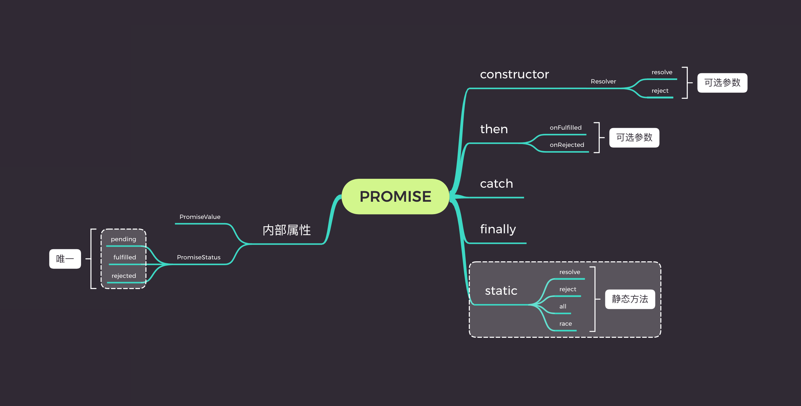
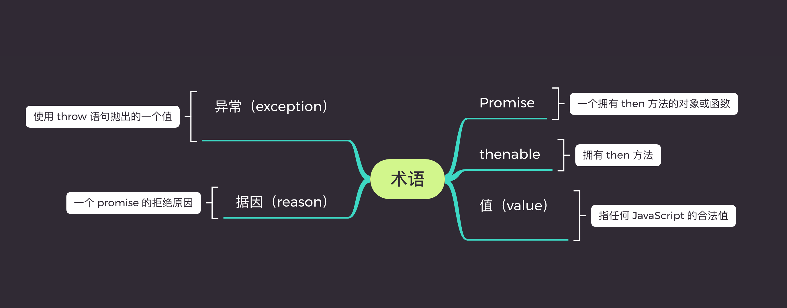
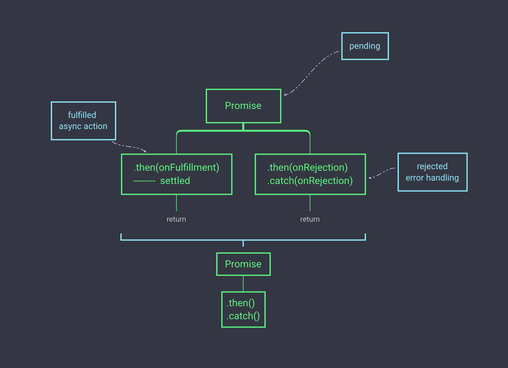

# TS 版 Promise 超详解

在 **npm 安全性问题随时爆发** 的今天，作为前端开发者的我们应该具备源码阅读的能力，最好能自己造个轮子。

拿 axios 这个我们常用的依赖来说，如果哪天被篡改了，那后果真不敢想象。即便这基本是不可能的，但切图仔中的精英不能就此停止追求进步的脚步。好在笔者前些天写了篇 [axios 重构经验分享](https://juejin.im/post/5bf7f1c0e51d455ed74f625c)，多少可以证明自己努力过。 😂

这还不够，翻了下最常用的依赖，其中 [es6-promise](https://github.com/stefanpenner/es6-promise) 特别惹眼，本来早就想深入了解 Promise ，于是毫不犹豫决定造它。由于笔者在过渡到 TypeScript ，所以本次开发依旧会采用 TypeScript 来敲。

本文适合从零了解或者想重新深入 Promise 的读者，并且可以得到如下知识：

- Promise 重要知识点

- Promise API 实现方法

笔者希望仅通过看这一篇文章就可以对 Promise 有个深刻的认知，所以会从方方面面讲 Promise，读者可选读。

## Promise

> Promise 表示一个异步操作的最终结果，与之进行交互的方式主要是 then 方法，该方法注册了两个回调函数，用于接收 promise 的终值或本 promise 不能执行的原因。

来看笔者用心画的一张 API 结构图 ( 看不清楚的可以进我的 [GitHub](https://github.com/leer0911/myPromise) 看，有大图和 xmind 源文件 )：



上图只是一个 **Promise 的 API 蓝图**，其实 `Promises/A+` 规范并不设计如何创建、解决和拒绝 promise，而是专注于提供一个通用的 then 方法。所以，Promise/A+ 规范的实现可以与那些不太规范但可用的实现能良好共存。如果大家都按规范来，那么就没有那么多兼容问题。(PS：包括 web 标准 ) 接着聊下 `Promises/A+`，看过的可以跳过。

## Promises/A+

所有 Promise 的实现都离不开 [Promises/A+](https://promisesaplus.com/) 规范，内容不多，建议大家可以过一遍。这边讲一些规范中重要的点

### 术语



- `Promise` 一个拥有 `then` 方法的对象或函数，其行为符合 `Promises/A+` 规范；

- `thenable` 一个定义了 `then` 方法的对象或函数，也可视作 “拥有 `then` 方法”

- `值（value）` 指**任何** JavaScript 的**合法值**（包括 undefined , thenable 和 promise）

- `异常（exception）` 使用 `throw` 语句抛出的一个值

- `据因（reason）` 表示一个 promise 的拒绝原因。

### Promise 的状态

> 一个 Promise 的当前状态**必须**为以下三种状态中的一种：等待态（Pending）、执行态（Fulfilled）和拒绝态（Rejected）。

- `等待态（Pending）`

  **处于等待态时，promise 需满足：`可以`迁移至执行态或拒绝态**

- `执行态（Fulfilled）`

  **处于执行态时，promise 需满足：`不能`迁移至其他任何状态，必须拥有一个`不可变`的`终值`**

- `拒绝态（Rejected）`

  **处于拒绝态时，promise 需满足：`不能`迁移至其他任何状态，必须拥有一个`不可变`的`据因`**

这里的不可变指的是恒等（即可用 `===` 判断相等），而不是意味着更深层次的不可变（ 指当 value 或 reason 不是[基本值](https://developer.mozilla.org/zh-CN/docs/Web/JavaScript/Data_structures)时，只要求其引用地址相等，但属性值可被更改）。

### Then 方法

> 一个 promise 必须提供一个 then 方法以访问其当前值、终值和据因。

promise 的 then 方法接受两个参数：

```js
promise.then(onFulfilled, onRejected);
```

- `onFulfilled` 和 `onRejected` 都是可选参数。

- 如果 `onFulfilled` 是函数，当 promise **执行结束**后其必须被调用，其**第一个参数**为 promise 的**终值**，在 promise 执行结束前其**不可被调用**，其调用次数不可超过一次

- 如果 `onRejected` 是函数，当 promise 被**拒绝**执行后其必须被调用，其**第一个参数**为 promise 的**据因**，在 promise 被拒绝执行前其**不可被调用**，其调用次数不可超过一次

- `onFulfilled` 和 `onRejected` 只有在执行环境堆栈仅包含平台代码 ( 指的是引擎、环境以及 promise 的实施代码 )时才可被调用

- 实践中要确保 `onFulfilled` 和 `onRejected` 方法异步执行，且应该在 `then` 方法被调用的那一轮事件循环之后的新执行栈中执行。

- `onFulfilled` 和 `onRejected` 必须被作为函数调用即没有 this 值 ( 也就是说在 严格模式（strict） 中，函数 this 的值为 undefined ；在非严格模式中其为全局对象。)

- then 方法可以被同一个 promise 调用多次

- then 方法必须返回一个 promise 对象

## Then 参数 (函数) 返回值

希望读者可以认真看这部分的内容，对于理解 promise 的 `then` 方法有很大的帮助。

先来看下 promise 执行过程：



大致的过程是，promise 会从 `pending` 转为 `fulfilled` 或 `rejected` ，然后对应调用 `then` 方法参数的 `onFulfilled` 或 `onRejected` ，最终返回 `promise` 对象。

```js
promise2 = promise1.then(onFulfilled, onRejected);
```

考虑以下几种情况：

- 如果 `onFulfilled` 或者 `onRejected` **抛出异常 e** ，则 promise2 **必须拒绝执行**，并返回 `拒因 e`

- 如果 `onFulfilled` **不是函数** 且 promise1 成功执行， promise2 必须成功执行并返回 **相同的值**

- 如果 `onRejected` **不是函数** 且 promise1 拒绝执行， promise2 必须拒绝执行并返回 **相同的据因**

希望进一步搞懂的，可以将下面代码拷贝到 chrome 控制台或其他可执行环境感受一下：

```js
// 通过改变 isResolve 来切换 promise1 的状态
const isResolve = true;

const promise1 = new Promise((resolve, reject) => {
  if (isResolve) {
    resolve('promise1 执行态');
  } else {
    reject('promise1 拒绝态');
  }
});

// 一、promise1 处于 resolve 以及 onFulfilled 抛出异常 的情况
// promise2 必须拒绝执行，并返回拒因
promise1
  .then(() => {
    throw '抛出异常!';
  })
  .then(
    value => {
      console.log(value);
    },
    reason => {
      console.log(reason);
    }
  );

// 二、promise1 处于 resolve 以及 onFulfilled 不是函数的情况
// promise2 必须成功执行并返回相同的值
promise1.then().then(value => {
  console.log(value);
});

// 三、promise1 处于 reject 以及 onRejected 不是函数的情况
// promise2 必须拒绝执行并返回拒因
promise1.then().then(
  () => {},
  reason => {
    console.log(reason);
  }
);

// 四、promise1 处于 resolve 以及 onFulfilled 有返回值时
promise1
  .then(value => {
    return value;
  })
  .then(value => {
    console.log(value);
  });
```

下面还有一个比较重要的情况，它关系到业务场景中传值问题：

- `onFulfilled` 或者 `onRejected` 返回 **一个 JavaScript 合法值** 的情况

我们先来假定 then 方法内部有一个叫做 `[[Resolve]]` 的方法用于处理这种特殊情况，下面来具体了解下这个方法。

## `[[Resolve]]` 方法

一般像 `[[]]` 这样的认为是内部实现，`[[Resolve]]` 方法接受两个参数：

```js
[[Resolve]](promise, x);
```

对于 `x` 值，有以下几种情况：

- `x` 有 **then 方法** 且看上去像一个 `Promise`

- `x` 为对象或函数

- `x` 为 `Promise`

## 参考

[Promises/A+](https://promisesaplus.com/)
